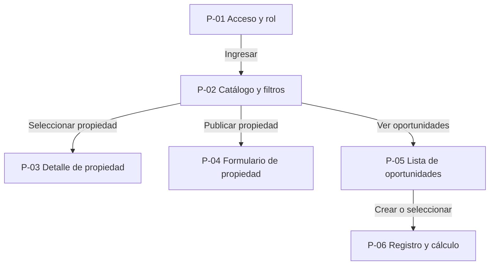
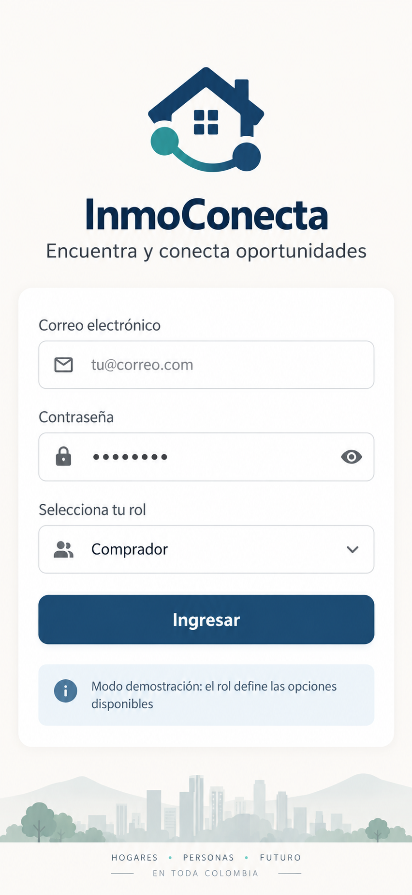
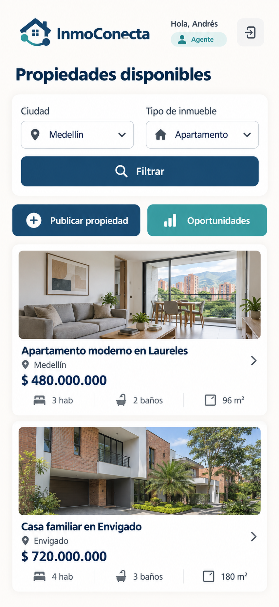
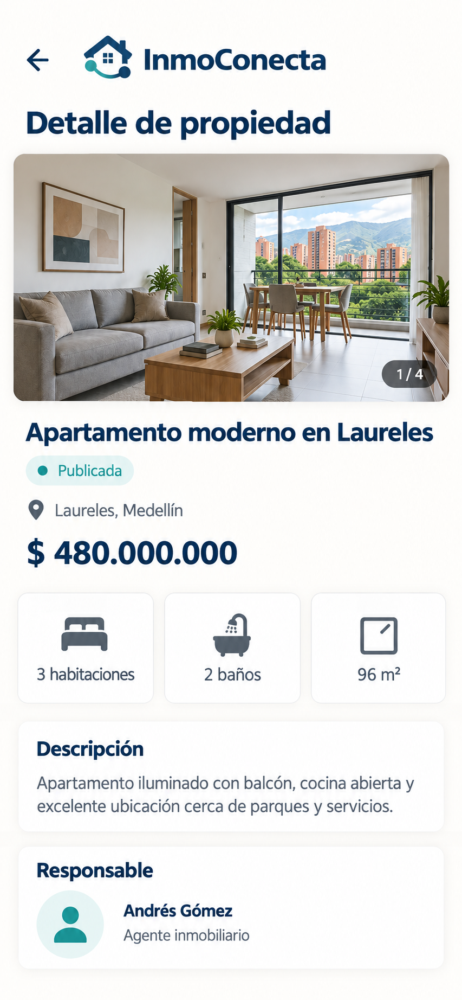
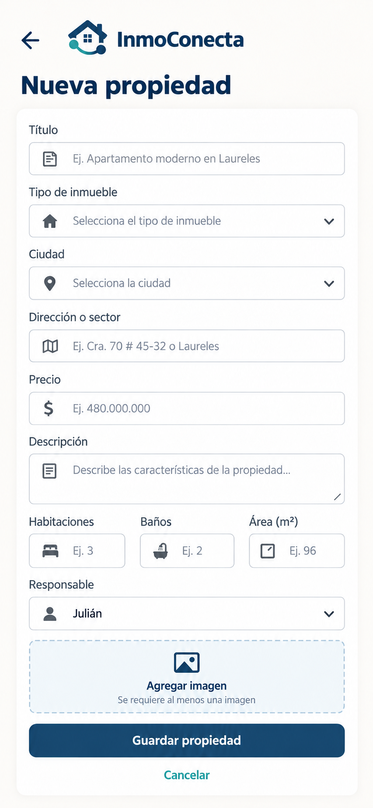

# InmoConecta

Aplicación móvil para centralizar la publicación y consulta de viviendas usadas
en Colombia. InmoConecta también permite registrar la participación de los
agentes en una oportunidad de venta y calcular de forma transparente la
distribución de la comisión entre la punta captadora y la punta colocadora.

## Información del proyecto

| Dato | Información |
|---|---|
| Curso | Programación Móvil (IF2004) |
| Grupo | 601 |
| Integrantes | Andrés y Julián |
| Plataforma | Flutter para dispositivos móviles |
| Estado | Definición y construcción del esqueleto navegable |

## Integrantes y pantallas

| ID | Integrante | Rama | Pantalla |
|---|---|---|---|
| P-01 | Andrés | `feature/andres` | Acceso y selección de rol |
| P-02 | Andrés | `feature/andres` | Catálogo con filtros integrados |
| P-03 | Andrés | `feature/andres` | Detalle de propiedad |
| P-04 | Julián | `feature/julian` | Formulario de propiedad |
| P-05 | Julián | `feature/julian` | Lista de oportunidades |
| P-06 | Julián | `feature/julian` | Registro y cálculo de oportunidad |

Cada integrante tiene asignadas tres pantallas. Los dos integrantes deben
realizar commits propios tanto en la documentación como en el código y revisar
el trabajo del compañero mediante Pull Requests.

## Orden de trabajo en Git

El desarrollo se realizará de forma secuencial para facilitar la revisión y
evitar que ambos integrantes modifiquen al mismo tiempo los archivos centrales
de navegación.

1. Crear `feature/andres` a partir de `main`.
2. Implementar y revisar P-01 a P-03 dentro de `lib/screen/`.
3. Hacer los commits de Andrés únicamente después de aprobar cada paso.
4. Publicar `feature/andres`, abrir un Pull Request hacia `main` y solicitar la
   revisión de Julián.
5. Integrar el Pull Request de Andrés en `main`.
6. Crear `feature/julian` desde la versión actualizada de `main`.
7. Implementar y revisar P-04 a P-06 dentro de `lib/screen/`.
8. Hacer los commits de Julián únicamente después de aprobar cada paso.
9. Publicar `feature/julian`, abrir un Pull Request hacia `main` y solicitar la
   revisión de Andrés.
10. Integrar el Pull Request de Julián en `main` y verificar el recorrido
    completo.

Ningún integrante fusionará su propio Pull Request. Las ramas se crearán en el
momento en que comience el trabajo correspondiente, no de manera simultánea.

## Flujo de navegación

El flujo inicia con el acceso y la selección de un rol demostrativo. Después de
ingresar, el usuario llega al catálogo y puede abrir los recorridos disponibles
para ese rol.

Todas las pantallas secundarias permitirán regresar mediante `Navigator.pop`.
La publicación estará disponible para propietarios y agentes; las oportunidades
estarán disponibles únicamente para agentes.

## Tabla de navegación

| Desde | Hacia | Acción del usuario | Método de Navigator | Datos que viajan |
|---|---|---|---|---|
| P-01 Acceso y rol | P-02 Catálogo y filtros | Ingresa sus credenciales y selecciona el rol | `Navigator.push` | Rol del usuario |
| P-02 Catálogo y filtros | P-03 Detalle de propiedad | Selecciona una propiedad | `Navigator.push` | Propiedad seleccionada |
| P-02 Catálogo y filtros | P-04 Formulario de propiedad | Presiona Publicar propiedad | `Navigator.push` | Rol del usuario |
| P-02 Catálogo y filtros | P-05 Lista de oportunidades | Presiona Ver oportunidades | `Navigator.push` | Rol del usuario |
| P-05 Lista de oportunidades | P-06 Registro y cálculo | Crea o selecciona una oportunidad | `Navigator.push` | Oportunidad opcional |
| Cualquier pantalla secundaria | Pantalla anterior | Presiona regresar | `Navigator.pop` | Resultado del formulario cuando aplique |

## Decisiones

- El MVP tendrá seis pantallas: tres desarrolladas por Andrés y tres
  desarrolladas por Julián.
- La pantalla inicial será P-01 Acceso y selección de rol.
- P-02 Catálogo será el punto principal de acceso a los recorridos de la
  aplicación después del inicio de sesión.
- Se usará `Navigator.push` para abrir una nueva pantalla y `Navigator.pop`
  para regresar, de acuerdo con las técnicas trabajadas en clase.
- La propiedad seleccionada viajará desde P-02 Catálogo hasta P-03 Detalle de
  propiedad.
- P-06 reunirá el formulario, el cálculo y el resumen de la oportunidad para no
  crear una pantalla de detalle separada en este MVP.
- El primer entregable utilizará datos demostrativos y navegación sencilla. La
  integración con Firebase se realizará en una etapa posterior.
- No se utilizarán inicialmente `go_router`, Riverpod ni una arquitectura por
  capas, porque el esqueleto navegable debe limitarse a los recursos vistos en
  clase.
- Cada pantalla se implementará en su propio archivo dentro de `lib/screen/`.
- Primero se completará e integrará la rama de Andrés; la rama de Julián se
  creará después desde la nueva versión de `main`.
- La presentación de la sustentación queda aplazada para la fase final del
  proyecto.

## Documentación

La definición del MVP se almacenará en
[`docs/definicion.md`](docs/definicion.md). Allí estarán los requerimientos, las
reglas de negocio, el modelo de datos, las historias de usuario y el mapa de
navegación.

Los mockups se almacenarán en [`docs/mockup/`](docs/mockup/), con una imagen
por cada pantalla y nombres relacionados con los identificadores P-01 a P-06.

## Capturas

### P-01 Acceso y selección de rol

### P-02 Catálogo con filtros integrados

### P-03 Detalle de propiedad

### P-04 Formulario de propiedad

Las capturas restantes se agregarán a medida que se aprueben los mockups y las
pantallas del esqueleto navegable.

## Cambios respecto al diseño

El alcance inicial de doce pantallas se redujo a un MVP de seis pantallas para
este proyecto. Se conservaron el login y los roles, el flujo de lista a detalle,
los formularios de propiedad y oportunidad y el cálculo de comisiones. Las
funciones aplazadas se registran en `docs/definicion.md`.
