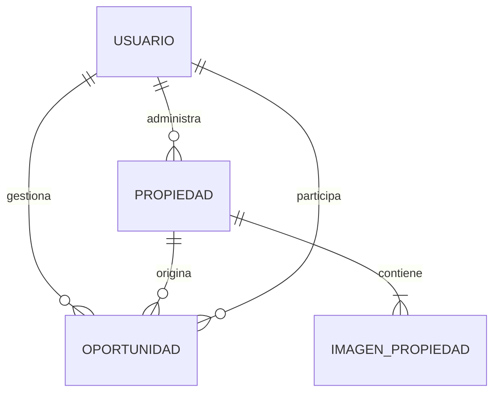
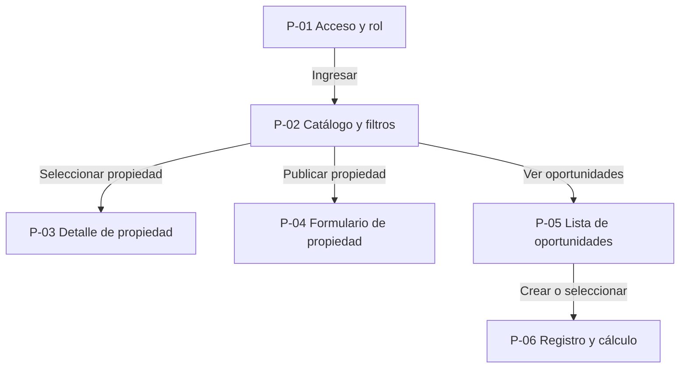
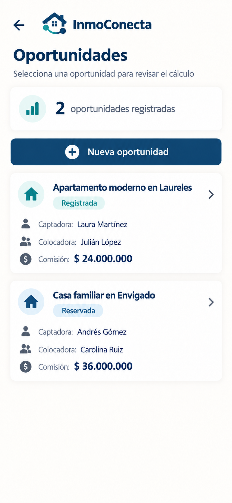

# InmoConecta

| | |
|---|---|
| Integrantes | Andrés y Julián |
| Curso y grupo | Programación Móvil (IF2004), grupo 601 |
| Versión | 1.8, 26 de septiembre de 2026 |
| Estado | Definición aprobada para el primer entregable |

## Tabla de contenido

1. [Descripción general](#1-descripción-general)
2. [Problema](#2-problema)
3. [Objetivos](#3-objetivos)
4. [Stakeholders, actores y roles](#4-stakeholders-actores-y-roles)
5. [Alcance](#5-alcance)
6. [Funcionalidades](#6-funcionalidades)
7. [Requerimientos funcionales](#7-requerimientos-funcionales)
8. [Requerimientos no funcionales](#8-requerimientos-no-funcionales)
9. [Reglas de negocio](#9-reglas-de-negocio)
10. [Modelo de datos](#10-modelo-de-datos)
11. [Pantallas y mapa de navegación](#11-pantallas-y-mapa-de-navegación)
12. [Mockup](#12-mockup)
13. [Historias de usuario, casos de uso, restricciones y supuestos](#13-historias-de-usuario-casos-de-uso-restricciones-y-supuestos)
14. [Arquitectura técnica y navegación implementada](#14-arquitectura-técnica-y-navegación-implementada)
15. [Historial de cambios](#historial-de-cambios)
16. [Referencias](#referencias)
17. [Declaración de uso de inteligencia artificial](#declaración-de-uso-de-inteligencia-artificial)

## 1. Descripción general

InmoConecta es una aplicación móvil dirigida a agentes inmobiliarios
independientes, pequeñas agencias, propietarios y compradores de vivienda usada
en Colombia. Centraliza la publicación y consulta de propiedades residenciales
y permite registrar de manera comprensible la participación de los agentes en
una oportunidad de venta.

Un comprador puede acceder y consultar propiedades. Un propietario o agente
puede registrar una nueva publicación. Además, el agente puede consultar y
registrar oportunidades con una punta captadora, una punta colocadora, una
comisión total y el porcentaje acordado para cada parte.

La primera entrega implementa un esqueleto navegable con datos demostrativos.
Las etapas posteriores incorporarán autenticación y persistencia en Firebase,
manteniendo las seis pantallas del MVP. Cualquier ampliación posterior deberá
registrarse primero como un cambio de alcance en este documento.

## 2. Problema

La oferta de vivienda usada se distribuye con frecuencia entre publicaciones en
redes sociales, mensajería y archivos particulares de cada agente. Esto produce
fichas con información desigual, dificulta comparar inmuebles y obliga al
interesado a repetir sus datos cuando desea solicitar contacto o una visita.

En las operaciones con dos agentes también puede faltar un registro común de
quién captó la propiedad, quién consiguió al comprador, cuál es la comisión
total y cómo se distribuye. Cuando esa información permanece en conversaciones
informales, aparecen diferencias de interpretación y se pierde trazabilidad de
lo acordado.

El problema afecta a tres grupos:

- Los compradores invierten tiempo consultando publicaciones incompletas y
  contactando responsables por canales diferentes.
- Los propietarios y agentes repiten información y tienen menor control sobre
  el estado de cada propiedad.
- Los agentes que comparten una venta carecen de un resumen único del cálculo
  de su comisión.

La solución se plantea como aplicación móvil porque la consulta, la captura de
fotografías, las visitas y el seguimiento de una oportunidad suceden mientras
los usuarios se desplazan. Como contexto de conectividad, la Encuesta Nacional
de Calidad de Vida 2024 del DANE informó que el 65,6 % de los hogares en
Colombia tenía acceso a internet. Por ello, la aplicación se diseña para una
consulta móvil y prevé conservar una copia local de la información consultada
recientemente cuando se implemente la persistencia.

## 3. Objetivos

### 3.1 Objetivo general

Construir una aplicación móvil que centralice la consulta y administración de
vivienda usada y que registre de forma trazable la distribución de comisiones
en oportunidades de venta inmobiliaria.

### 3.2 Objetivos específicos

- Permitir que un usuario ingrese con correo y contraseña y acceda con uno de
  los tres roles definidos.
- Permitir que un comprador llegue desde el catálogo hasta el detalle de una
  propiedad en un máximo de dos acciones y que el detalle corresponda al
  inmueble seleccionado.
- Permitir filtrar el catálogo por ciudad y tipo de inmueble en una sola
  pantalla.
- Permitir que propietarios y agentes creen una ficha con todos los
  campos obligatorios definidos en RN-04.
- Calcular los valores de las dos puntas de una comisión con precisión de dos
  decimales y validar que sus porcentajes sumen 100 %.
- Conservar en la nube propiedades y oportunidades para que continúen
  disponibles después de cerrar la app cuando se implemente la persistencia.
- Entregar un esqueleto Flutter con las seis pantallas P-01 a P-06, sin
  pantallas huérfanas y con navegación de ida y regreso.

## 4. Stakeholders, actores y roles

| Tipo | Actor o interesado | Interés y permisos |
|---|---|---|
| Rol | Comprador | Consulta y filtra el catálogo y abre el detalle de una propiedad. |
| Rol | Propietario | Realiza las acciones de consulta y registra una nueva propiedad. |
| Rol | Agente inmobiliario | Realiza las acciones de consulta, registra propiedades y consulta o registra oportunidades con su distribución de comisión. |
| Stakeholder | Pequeña agencia inmobiliaria | Busca centralizar inventario y dar trazabilidad a las operaciones compartidas de sus agentes. |
| Stakeholder | Equipo del curso | Define, implementa, prueba y mantiene el producto durante el semestre. |
| Stakeholder | Docente | Evalúa la coherencia entre definición, mockup, navegación, código e historial de Git. |

### 4.1 Inicio de sesión y autorización

El acceso usa correo y contraseña. En el esqueleto navegable se selecciona un
rol demostrativo para comprobar los recorridos. Cuando se integre Firebase, el
rol estará asociado con la cuenta y la sesión permanecerá activa hasta que el
usuario la cierre.

La interfaz mostrará las opciones correspondientes al rol. Ocultar una opción
no reemplaza la seguridad: las operaciones sobre datos también deberán ser
rechazadas por las reglas del servidor cuando el usuario no tenga permiso.

## 5. Alcance

`docs/alcance.md` conserva la visión amplia considerada al iniciar el proyecto.
Para este MVP, la fuente de verdad implementable es el alcance reducido que se
presenta a continuación.

### 5.1 Incluye

- Inicio de sesión con correo, contraseña y rol.
- Catálogo de vivienda usada con propiedades publicadas.
- Filtros integrados en el catálogo por ciudad y tipo de inmueble.
- Detalle con imágenes, ubicación, precio, descripción y características.
- Formulario para registrar una propiedad.
- Lista de oportunidades inmobiliarias.
- Registro de oportunidades con propiedad, punta captadora, punta colocadora,
  comisión total y porcentajes de distribución.
- Cálculo del valor correspondiente a cada punta.
- Persistencia futura en Firebase Authentication, Cloud Firestore y Cloud
  Storage.
- Esqueleto navegable de seis pantallas para el primer entregable.

### 5.2 No incluye

- Pagos, recaudos, custodia de dinero o transferencia de comisiones.
- Elaboración de contratos, firma electrónica o trámites notariales,
  registrales, tributarios o hipotecarios.
- Arriendos, inmuebles comerciales, lotes o proyectos de construcción.
- Avalúos automáticos, recorridos virtuales, chat en tiempo real o
  recomendaciones con inteligencia artificial.
- Integraciones con bancos, notarías, catastro, portales inmobiliarios o CRM.
- Panel administrativo avanzado, versión web o aplicación de escritorio.
- Notificaciones automáticas y agenda sincronizada con calendarios externos.
- Registro autónomo y recuperación de contraseña.
- Favoritos y solicitudes de contacto o visita.
- Pantallas separadas para filtros, propiedades propias y detalle de una
  oportunidad.
- Edición, desactivación y gestión avanzada de estados de propiedades y
  oportunidades.
- Material de presentación durante esta etapa del desarrollo.

## 6. Funcionalidades

### 6.1 Funciones comunes

- Iniciar sesión, elegir un rol demostrativo y cerrar sesión.
- Consultar el catálogo, aplicar filtros y abrir el detalle de una propiedad.

### 6.2 Funciones del comprador

- Consultar el catálogo filtrado y ver los datos de una propiedad.

### 6.3 Funciones del propietario

- Registrar una propiedad mediante un formulario.

### 6.4 Funciones del agente inmobiliario

- Registrar una propiedad mediante un formulario.
- Consultar y registrar oportunidades de venta.
- Identificar la punta captadora y la punta colocadora.
- Calcular y conservar la distribución de la comisión.

## 7. Requerimientos funcionales

| ID | Requerimiento | Rol | Prioridad | Pantalla |
|---|---|---|---|---|
| RF-01 | La app debe permitir iniciar sesión con correo y contraseña. | Todos | Alta | P-01 |
| RF-02 | La app debe permitir seleccionar un rol demostrativo y mostrar únicamente sus recorridos. | Todos | Alta | P-01, P-02 |
| RF-03 | La app debe mostrar un catálogo de propiedades publicadas. | Todos | Alta | P-02 |
| RF-04 | La app debe filtrar el catálogo por ciudad y tipo de inmueble sin abrir otra pantalla. | Todos | Alta | P-02 |
| RF-05 | La app debe abrir el detalle de la propiedad seleccionada y mostrar sus datos. | Todos | Alta | P-03 |
| RF-06 | La app debe permitir registrar una propiedad con los campos obligatorios de RN-04. | Propietario, agente | Alta | P-04 |
| RF-07 | La app debe validar los campos obligatorios antes de aceptar la propiedad. | Propietario, agente | Alta | P-04 |
| RF-08 | La app debe listar las oportunidades disponibles para el agente. | Agente | Alta | P-05 |
| RF-09 | La app debe permitir crear una oportunidad asociada con una propiedad. | Agente | Alta | P-06 |
| RF-10 | La app debe registrar la punta captadora y la punta colocadora. | Agente | Alta | P-06 |
| RF-11 | La app debe calcular el valor de cada punta a partir de la comisión total y sus porcentajes. | Agente | Alta | P-06 |
| RF-12 | La app debe rechazar una distribución cuyos porcentajes no sumen 100 %. | Agente | Alta | P-06 |
| RF-13 | La app debe mostrar en P-06 el resumen de una oportunidad nueva o seleccionada. | Agente | Media | P-05, P-06 |
| RF-14 | La app debe conservar propiedades y oportunidades entre sesiones. | Propietario, agente | Alta | P-04 a P-06 |
| RF-15 | La app debe permitir cerrar la sesión desde el catálogo. | Todos | Media | P-02 |

## 8. Requerimientos no funcionales

| ID | Categoría | Requerimiento medible |
|---|---|---|
| RNF-01 | Persistencia | Los datos confirmados deben continuar disponibles después de cerrar y volver a abrir la aplicación. |
| RNF-02 | Sin conexión | El catálogo debe mostrar la última información almacenada localmente cuando no haya conexión, indicando que puede estar desactualizada. |
| RNF-03 | Rendimiento | Con una conexión estable, el catálogo debe mostrar contenido o un estado de carga en menos de 3 segundos en un teléfono Android de gama media. |
| RNF-04 | Rendimiento | El cálculo de la comisión debe actualizarse en menos de 1 segundo después de ingresar valores válidos. |
| RNF-05 | Usabilidad | Todo control táctil principal debe tener un área mínima de 48 por 48 píxeles lógicos. |
| RNF-06 | Usabilidad | Los formularios deben identificar los campos obligatorios y mostrar un mensaje específico junto a cada dato inválido. |
| RNF-07 | Compatibilidad | La aplicación debe funcionar desde Android 8.0, API 26, en pantallas de 5 a 6,7 pulgadas. |
| RNF-08 | Seguridad | La contraseña no debe almacenarse en texto plano en el dispositivo ni en Cloud Firestore. |
| RNF-09 | Seguridad | Toda lectura o modificación en Firebase debe exigir autenticación y validar rol y propiedad del registro. |
| RNF-10 | Integridad | Los valores de comisión deben guardarse con precisión de dos decimales y la suma de las dos partes debe coincidir con la comisión total. |
| RNF-11 | Datos | Cada imagen cargada debe ser JPEG o PNG y no superar 5 MB. |
| RNF-12 | Accesibilidad | Los textos y controles esenciales deben mantener una relación de contraste mínima de 4,5:1. |

## 9. Reglas de negocio

- **RN-01.** Cada cuenta tiene un solo rol activo: comprador, propietario o
  agente inmobiliario.
- **RN-02.** El correo usado para acceder debe tener un formato válido.
- **RN-03.** Solo los roles propietario y agente pueden abrir el formulario de
  propiedad.
- **RN-04.** Una propiedad requiere título, tipo, ciudad, dirección o sector,
  precio, descripción, número de habitaciones, número de baños, área en metros
  cuadrados, responsable y al menos una imagen antes de publicarse.
- **RN-05.** Los estados de una propiedad son `borrador`, `publicada`,
  `reservada`, `vendida` e `inactiva`.
- **RN-06.** Solo las propiedades `publicada` o `reservada` aparecen en el
  catálogo; una propiedad `vendida` o `inactiva` deja de ofrecerse.
- **RN-07.** Solo un agente puede crear o consultar una oportunidad de venta.
- **RN-08.** Los estados previstos de una oportunidad son `registrada`, `reservada`,
  `vendida` y `cancelada`.
- **RN-09.** Una oportunidad debe asociarse con una propiedad existente y con
  una punta captadora y una punta colocadora identificadas.
- **RN-10.** La comisión total debe ser mayor que cero y no puede superar el
  precio de venta registrado.
- **RN-11.** Los porcentajes de la punta captadora y la punta colocadora deben
  ser mayores o iguales a cero y sumar exactamente 100 %.
- **RN-12.** El valor de cada punta es la comisión total multiplicada por su
  porcentaje y dividida entre 100.
- **RN-13.** El cálculo de comisión es informativo; la app no procesa ni
  certifica pagos.
- **RN-14.** Los valores monetarios se expresan en pesos colombianos (COP).

## 10. Modelo de datos

| Entidad | Atributos principales | Dónde se guarda |
|---|---|---|
| Usuario | id, nombre, correo, rol, fechaCreacion | Firebase Authentication y colección `usuarios`; sesión en el dispositivo |
| Propiedad | id, responsableId, titulo, tipo, ciudad, sector, precio, descripcion, habitaciones, banos, area, estado, imagenes, fechaPublicacion | Colección `propiedades`; copia local de las consultas recientes |
| Oportunidad | id, propiedadId, agenteResponsableId, captadorId, colocadorId, precioVenta, comisionTotal, porcentajeCaptador, porcentajeColocador, valorCaptador, valorColocador, estado, fechaCreacion | Colección `oportunidades`; copia local de consultas recientes |
| ImagenPropiedad | ruta, propiedadId, url, tipoMime, tamano | Archivo en Firebase Storage; URL y metadatos en `propiedades` |

### 10.1 Relaciones



Una propiedad tiene un responsable principal y una o más imágenes. Una
oportunidad pertenece a una propiedad y referencia a los participantes de las
dos puntas.

## 11. Pantallas y mapa de navegación

| ID | Pantalla | Rol | Para qué sirve | Atiende | Responsable |
|---|---|---|---|---|---|
| P-01 | Acceso y selección de rol | Todos | Ingresar con correo y contraseña y seleccionar el rol demostrativo. | RF-01, RF-02 | Andrés |
| P-02 | Catálogo con filtros integrados | Todos | Consultar y filtrar propiedades y acceder a los recorridos del rol. | RF-03, RF-04, RF-15 | Andrés |
| P-03 | Detalle de propiedad | Todos | Mostrar los datos de la propiedad seleccionada en P-02. | RF-05 | Andrés |
| P-04 | Formulario de propiedad | Propietario, agente | Registrar una propiedad y validar sus campos. | RF-06, RF-07, RF-14 | Julián |
| P-05 | Lista de oportunidades | Agente | Consultar oportunidades y seleccionar una existente. | RF-08, RF-13 | Julián |
| P-06 | Registro y cálculo de oportunidad | Agente | Crear o consultar una oportunidad y calcular su comisión. | RF-09 a RF-14 | Julián |

### 11.1 Mapa de navegación



Cada pantalla secundaria regresa a la anterior con `Navigator.pop`. P-03
recibe la propiedad seleccionada desde P-02; este es el paso de datos obligatorio
de lista a detalle. P-06 recibe opcionalmente la oportunidad seleccionada desde
P-05 para mostrarla en el mismo formulario usado para el registro y el cálculo.

## 12. Mockup

Los mockups se diseñarán en formato vertical de teléfono y se almacenarán en
`docs/mockup/`. Cada imagen conservará el mismo identificador usado en los
requerimientos, la navegación y el código.

| ID | Archivo | Contenido visual previsto | Estado |
|---|---|---|---|
| P-01 | `mockup/p01-acceso.png` | Logotipo, correo, contraseña, selector de rol y botón Ingresar. | Aprobado |
| P-02 | `mockup/p02-catalogo.png` | Filtros de ciudad y tipo, tarjetas de propiedades y accesos según el rol. | Aprobado |
| P-03 | `mockup/p03-detalle-propiedad.png` | Imagen, precio, ubicación, descripción y características. | Aprobado |
| P-04 | `mockup/p04-formulario-propiedad.png` | Campos de la ficha, referencia de imagen y botón Guardar. | Aprobado |
| P-05 | `mockup/p05-oportunidades.png` | Lista con propiedad, participantes, estado y botón Nueva oportunidad. | Aprobado |
| P-06 | `mockup/p06-registro-oportunidad.png` | Propiedad, puntas, comisión, porcentajes, cálculo y resumen. | Pendiente |

Cada imagen aprobada se mostrará a continuación mediante una ruta relativa.

### 12.1 P-01 Acceso y selección de rol


El acceso presenta la identidad de InmoConecta, los campos de correo y
contraseña, un selector de rol y el botón Ingresar. Una nota informa que el rol
se utiliza en modo demostrativo para habilitar los recorridos del MVP.

### 12.2 P-02 Catálogo con filtros integrados


El catálogo integra los filtros de ciudad y tipo de inmueble sobre una lista de
tarjetas seleccionables. Cuando el rol es agente, también muestra los accesos a
Publicar propiedad y Oportunidades.

### 12.3 P-03 Detalle de propiedad


El detalle conserva el nombre, la ubicación, el precio y las características de
la propiedad seleccionada en P-02. También muestra una imagen principal, una
descripción, el responsable y una acción clara para regresar al catálogo.

### 12.4 P-04 Formulario de propiedad


El formulario reúne los datos obligatorios de la ficha inmobiliaria, la
referencia de al menos una imagen y la acción Guardar propiedad. Su diseño
permite señalar los campos incompletos antes de aceptar el registro y ofrece una
acción para cancelar y regresar al catálogo.

### 12.5 P-05 Lista de oportunidades



La lista resume las oportunidades registradas y muestra para cada una la
propiedad asociada, las puntas captadora y colocadora, el estado y la comisión.
El agente puede seleccionar una tarjeta para revisar su cálculo en P-06 o usar
la acción Nueva oportunidad para iniciar un registro.

## 13. Historias de usuario, casos de uso, restricciones y supuestos

### 13.1 Historias de usuario

- **HU-01.** Como usuario, quiero iniciar sesión y acceder con mi rol para ver
  únicamente los recorridos que me corresponden.
- **HU-02.** Como comprador, quiero filtrar las propiedades por mis criterios
  para revisar únicamente opciones relevantes.
- **HU-03.** Como comprador, quiero abrir la propiedad que seleccioné para ver
  su información completa.
- **HU-04.** Como propietario, quiero registrar una ficha completa de mi
  vivienda para ofrecerla a posibles compradores.
- **HU-05.** Como agente, quiero consultar las oportunidades registradas para
  seleccionar la que necesito revisar.
- **HU-06.** Como agente, quiero registrar las dos puntas de una venta para
  conservar quién participó en la operación.
- **HU-07.** Como agente, quiero distribuir la comisión por porcentajes para
  conocer el valor que corresponde a cada punta.
- **HU-08.** Como agente, quiero consultar el resumen de una oportunidad para
  explicar cómo se obtuvo cada valor.

### 13.2 Caso de uso CU-01: consultar una propiedad

| Campo | Descripción |
|---|---|
| Actor principal | Comprador |
| Precondición | El usuario tiene una sesión activa y existen propiedades publicadas. |
| Flujo principal | 1. Abre el catálogo. 2. Aplica filtros opcionales. 3. Selecciona una tarjeta. 4. La app envía la propiedad seleccionada. 5. El detalle muestra sus datos. |
| Resultado | El comprador ve el detalle correspondiente a la propiedad seleccionada. |
| Excepción | Si no hay resultados, el catálogo informa que debe cambiar los filtros. Si la propiedad dejó de estar disponible, el detalle muestra su estado actualizado. |

### 13.3 Caso de uso CU-02: registrar una oportunidad

| Campo | Descripción |
|---|---|
| Actor principal | Agente inmobiliario |
| Precondición | El agente tiene sesión activa y la propiedad seleccionada no está vendida ni inactiva. |
| Flujo principal | 1. Abre Oportunidades. 2. Presiona Nueva oportunidad. 3. Selecciona la propiedad y las dos puntas. 4. Ingresa el precio de venta, la comisión total y los porcentajes. 5. La app valida que sumen 100 %. 6. Calcula ambos valores. 7. El resumen aparece en la misma pantalla. |
| Resultado | La oportunidad queda registrada con sus participantes, valores y estado `registrada`. |
| Excepción | Si faltan datos, la comisión no es válida o los porcentajes no suman 100 %, la app no guarda y señala los campos que deben corregirse. |

### 13.4 Restricciones

- El primer entregable usa únicamente widgets y navegación vistos en clase.
- La aplicación objetivo es móvil y la compatibilidad exigida es Android.
- El esqueleto inicial trabaja con datos demostrativos; no simula que Firebase
  ya está integrado.
- La aplicación no puede procesar dinero ni presentar su cálculo como un
  comprobante de pago.
- Los nombres de archivos no contienen espacios, tildes ni la letra eñe.
- Todo cambio de alcance debe registrarse en este documento y en Git.

### 13.5 Supuestos

- Cada usuario cuenta con un correo electrónico y acceso ocasional a internet.
- El responsable de la publicación tiene autorización para ofrecer el inmueble.
- Los agentes conocen y aceptan los porcentajes antes de registrar la
  oportunidad.
- El precio, las características y el estado son declarados por el responsable
  de la propiedad.
- Durante la primera entrega, los datos fijos son suficientes para demostrar la
  navegación y el paso de información.

## 14. Arquitectura técnica y navegación implementada

### 14.1 Entorno

| Elemento | Versión o decisión |
|---|---|
| Flutter | 3.47.5, canal estable |
| Dart | 3.13.4 |
| SDK declarado | `^3.13.4` |
| Interfaz | Material Design con widgets nativos de Flutter |
| Navegación inicial | `Navigator.push`, `MaterialPageRoute` y `Navigator.pop` |
| Datos de la primera entrega | Objetos y listas demostrativas en memoria |

La primera entrega no agregará paquetes de navegación, manejo de estado ni
arquitecturas avanzadas. En una etapa posterior se prevén `firebase_auth`,
`cloud_firestore` y `firebase_storage` para cumplir RF-14. Las versiones se
fijarán en `pubspec.yaml` cuando se implemente esa etapa.

### 14.2 Estructura prevista de `lib/`

```text
lib/
├── main.dart
├── modelos/
│   ├── oportunidad.dart
│   └── propiedad.dart
└── screen/
│   ├── acceso_pantalla.dart
│   ├── catalogo_pantalla.dart
│   ├── detalle_propiedad_pantalla.dart
│   ├── formulario_propiedad_pantalla.dart
│   ├── oportunidades_pantalla.dart
│   └── registro_oportunidad_pantalla.dart
```

### 14.3 Tabla de rutas

| ID | Archivo | Se llega desde | Recibe |
|---|---|---|---|
| P-01 | `lib/screen/acceso_pantalla.dart` | `main.dart` | Nada |
| P-02 | `lib/screen/catalogo_pantalla.dart` | P-01 con `Navigator.push` | Rol del usuario |
| P-03 | `lib/screen/detalle_propiedad_pantalla.dart` | P-02 con `Navigator.push` | Objeto `Propiedad` seleccionado |
| P-04 | `lib/screen/formulario_propiedad_pantalla.dart` | P-02 con `Navigator.push` | Rol del usuario |
| P-05 | `lib/screen/oportunidades_pantalla.dart` | P-02 con `Navigator.push` | Rol del usuario |
| P-06 | `lib/screen/registro_oportunidad_pantalla.dart` | P-05 con `Navigator.push` | Objeto `Oportunidad` opcional |

### 14.4 Criterios de implementación

- Cada pantalla será un widget ubicado en su propio archivo y contendrá
  `Scaffold`, título y contenido reconocible.
- Todos los archivos que construyen P-01 a P-06 estarán dentro de
  `lib/screen/`. No se creará una segunda carpeta para las pantallas.
- `main.dart` configurará el tema y abrirá únicamente P-01.
- P-02 construirá P-03 con el objeto seleccionado, no con un valor fijo.
- Los formularios comprobarán campos obligatorios antes de navegar.
- Todos los recorridos del mapa permitirán regresar sin dejar pantallas
  huérfanas.

### 14.5 Flujo de ramas, aprobación e integración

El trabajo de pantallas se desarrollará en dos etapas consecutivas:

1. Se creará `feature/andres` desde `main` para implementar P-01 a P-03.
2. Cada paso será revisado y aprobado antes de crear su commit.
3. Al terminar las tres pantallas se abrirá un Pull Request hacia `main`, que
   deberá ser revisado y fusionado por Julián.
4. Solo después de integrar ese Pull Request se creará `feature/julian` desde
   el `main` actualizado.
5. En `feature/julian` se implementarán P-04 a P-06, también con aprobación
   previa a cada commit.
6. El Pull Request de Julián será revisado y fusionado por Andrés.
7. La verificación final de navegación se realizará sobre `main` con los dos
   aportes integrados.

Este orden permite que Julián construya sus pantallas sobre la navegación ya
integrada de Andrés y deja evidencia separada de los aportes de ambos
integrantes. Ningún integrante debe fusionar su propio Pull Request.

## Historial de cambios

| Versión | Fecha | Cambio | Responsable |
|---|---|---|---|
| 1.0 | 25 de septiembre de 2026 | Definición inicial de InmoConecta, doce pantallas y reparto de seis pantallas por integrante. | Andrés y Julián |
| 1.1 | 25 de septiembre de 2026 | Se fijó `lib/screen/` como ubicación única de las pantallas y se documentó el desarrollo secuencial por ramas. | Andrés y Julián |
| 1.2 | 25 de septiembre de 2026 | Se redujo el MVP a seis pantallas, tres por integrante, y se aplazaron funciones de la visión completa. | Andrés y Julián |
| 1.3 | 26 de septiembre de 2026 | Se aprobó y documentó el mockup de P-01 Acceso y selección de rol. | Andrés |
| 1.4 | 26 de septiembre de 2026 | Se aprobó y documentó el mockup de P-02 Catálogo con filtros integrados. | Andrés |
| 1.5 | 26 de septiembre de 2026 | Se aprobó y documentó el mockup de P-03 Detalle de propiedad. | Andrés |
| 1.6 | 26 de septiembre de 2026 | Se aclaró que `docs/alcance.md` representa la visión futura y que este documento define el MVP vigente. | Andrés |
| 1.7 | 26 de septiembre de 2026 | Se aprobó y documentó el mockup de P-04 Formulario de propiedad. | Julián |
| 1.8 | 26 de septiembre de 2026 | Se aprobó y documentó el mockup de P-05 Lista de oportunidades. | Julián |

## Referencias

- DANE. *Encuesta Nacional de Calidad de Vida 2024, boletín técnico*. Usada
  como contexto de conectividad en la sección 2.
  <https://www.dane.gov.co/files/operaciones/ECV/bol-ECV-2024.pdf>
- Flutter. *Navigate to a new screen and back*. Usada para definir
  `Navigator.push`, `MaterialPageRoute` y `Navigator.pop` en las secciones 11 y
  14. <https://docs.flutter.dev/cookbook/navigation/navigation-basics>
- Firebase. *Get started with Firebase Authentication on Flutter*. Usada para
  la estrategia futura de registro e inicio de sesión de la sección 4.
  <https://firebase.google.com/docs/auth/flutter/start>
- Firebase. *Cloud Firestore Data model*. Usada para diseñar las colecciones y
  documentos de la sección 10.
  <https://firebase.google.com/docs/firestore/data-model>
- Firebase. *Get started with Cloud Storage on Flutter*. Usada para definir el
  almacenamiento futuro de imágenes de propiedades.
  <https://firebase.google.com/docs/storage/flutter/start>

## Declaración de uso de inteligencia artificial

El equipo utilizó Codex, un asistente de inteligencia artificial de OpenAI,
para organizar la estructura de este documento, convertir el alcance aprobado
en requerimientos identificados, revisar la correspondencia entre pantallas y
rutas, y redactar una primera versión del contenido. El equipo indicó el tema,
los integrantes, el grupo, el alcance y la distribución de pantallas, y aprobó
la estructura del README antes de elaborar esta definición.

Se aceptaron las propuestas que conservan el alcance de InmoConecta y las
técnicas vistas en clase. Se corrigió la propuesta técnica inicial para no usar
Riverpod, `go_router` ni Clean Architecture en el esqueleto navegable. Se
descartó desarrollar la presentación en esta etapa. Andrés y Julián revisarán,
corregirán y deberán poder explicar cada requerimiento, regla, pantalla y línea
de código antes de entregar el proyecto.
